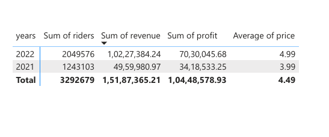

# Urban Cycle Analytics 🚲

## Overview
End-to-end data analytics project analyzing bike-share usage, revenue trends,
profitability, and seasonality using SQL and Power BI.

## Tools Used
- SQL (data transformation, KPI calculations)
- Power BI (DAX, data modeling, interactive dashboards)

## Key Insights
- Peak revenue occurs during mid-day and early evening hours
- Summer season generates the highest revenue
- Registered users account for over 80% of total riders
- Profit margins increased year-over-year

## Dashboard

## Yearly Summary

## Business Recommendation
- Suggested a conservative 10–15% price increase based on demand and profit trends
- Recommended segmented pricing for casual vs registered users
- Emphasized monitoring demand post-price adjustment

## Files
- Urban_Cycle_Analytics.pbix
- SQL_Query.sql
